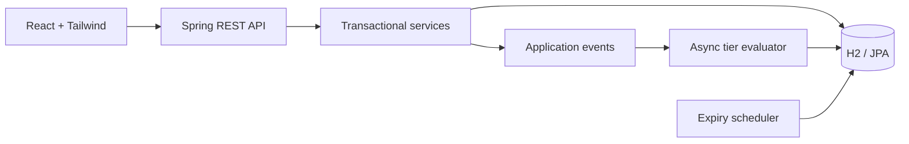

# FirstClub Membership Platform

A demo-ready membership system with a Spring Boot REST API, H2 persistence, async tier evaluation, an append-only event history, and a React/Tailwind dashboard.

## Run

Requirements: Java 17+, Maven 3.9+, and Node.js 18+.

```bash
./run.sh
```

The UI opens at [http://localhost:5173](http://localhost:5173), and the API runs at `http://localhost:8080/api/v1`.

You can also run each application separately:

```bash
cd backend && mvn spring-boot:run
cd frontend && npm install && npm run dev
```

H2 console: [http://localhost:8080/h2-console](http://localhost:8080/h2-console)

- JDBC URL: `jdbc:h2:mem:firstclub`
- User: `sa`
- Password: blank

## Architecture



Important design points:

- `TierCriteriaEvaluator` makes order-count, order-value, and cohort checks independently extensible.
- Activity thresholds use OR semantics (`count OR value`) to match the seeded Gold and Platinum rules. A configured cohort remains an additional AND requirement.
- `BenefitResolver` is reusable outside the membership API, such as during checkout calculation.
- `MembershipEvent` is append-only and captures every membership state transition.
- `UserMembership.version` enables optimistic locking. `recordOrder` retries optimistic-lock failures with exponential backoff.
- Order events are handled asynchronously after transaction commit by a 2-to-10 thread executor.
- The expiry scheduler is correct for this single-instance demo. A multi-instance production deployment should add ShedLock or equivalent distributed coordination.

## Seeded Data

Plans:

| Plan | Duration | Price |
| --- | ---: | ---: |
| Monthly | 1 month | ₹299 |
| Quarterly | 3 months | ₹799 |
| Yearly | 12 months | ₹2499 |

Tier promotion:

| Tier | Rule |
| --- | --- |
| Silver | Default |
| Gold | 5 orders or ₹2,000 total order value |
| Platinum | 15 orders or ₹8,000 total order value |

Tier prices are derived from each plan's Silver base price:

| Tier | Price multiplier |
| --- | ---: |
| Silver | 1.00× |
| Gold | 1.25× |
| Platinum | 1.50× |

## API Examples

List plans and tiers:

```bash
curl http://localhost:8080/api/v1/plans
curl http://localhost:8080/api/v1/tiers
```

Subscribe user `101` using IDs from the plan response:

```bash
curl -X POST http://localhost:8080/api/v1/subscriptions \
  -H 'Content-Type: application/json' \
  -d '{"userId":101,"planId":1,"tierId":1,"cohortTag":"VIP"}'
```

Get the active membership:

```bash
curl http://localhost:8080/api/v1/subscriptions/user/101
```

Record an order and trigger asynchronous tier evaluation:

```bash
curl -X POST http://localhost:8080/api/v1/subscriptions/user/101/record-order \
  -H 'Content-Type: application/json' \
  -d '{"orderValue":2500}'
```

Upgrade, downgrade, cancel, and inspect history:

```bash
curl -X PATCH http://localhost:8080/api/v1/subscriptions/1/upgrade \
  -H 'Content-Type: application/json' \
  -d '{"newTierId":2}'

curl -X PATCH http://localhost:8080/api/v1/subscriptions/1/downgrade \
  -H 'Content-Type: application/json' \
  -d '{"newTierId":1}'

curl http://localhost:8080/api/v1/subscriptions/1/history
curl -X DELETE http://localhost:8080/api/v1/subscriptions/1
```

## Project Layout

```text
backend/   Spring Boot API, domain model, services, scheduler, and tests
frontend/  React 18 application with Vite and Tailwind
run.sh     Starts both applications and installs frontend packages when needed
```

## Deploy To Render

The root-level `render.yaml` defines:

- A Docker-based Spring Boot web service.
- A React static site with SPA route rewrites.
- A managed PostgreSQL database.

Push this repository to GitHub or GitLab, then create a new Render Blueprint and
select the repository. Render creates and connects all three resources.
